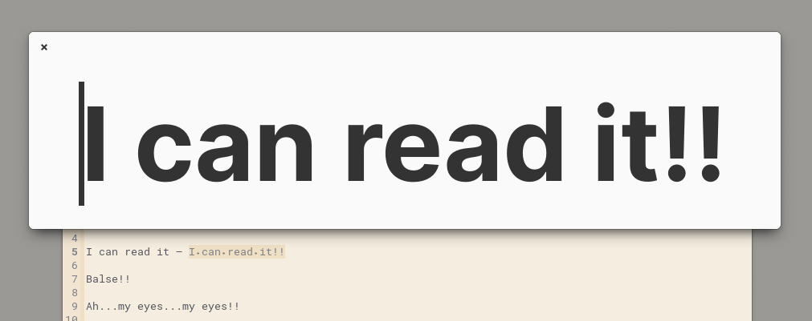
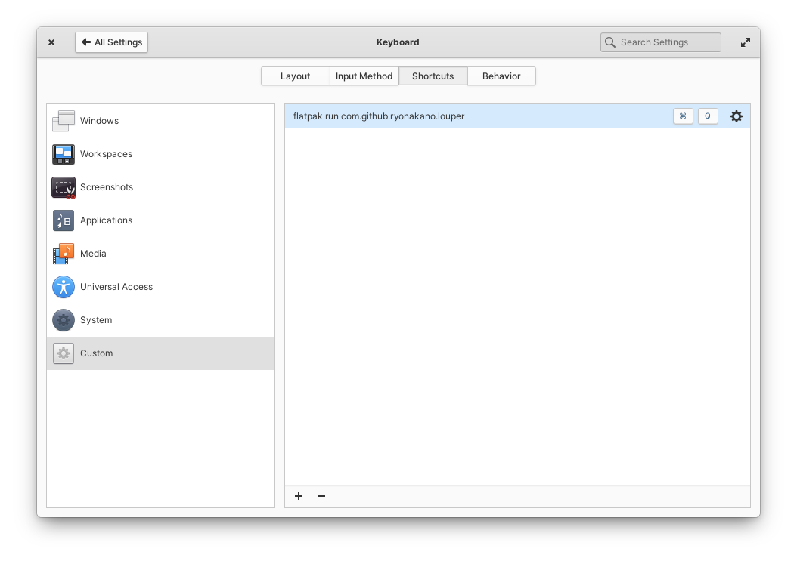

# Louper

Louper is a text magnification app designed for elementary OS. Prototype for https://github.com/elementary/wingpanel-indicator-a11y/issues/35

## Usage

1. Select some text
2. Launch the app. The app shows the selected text in huge size
3. Press `Ctrl+C` to copy the text showing
4. Press `Esc`/`Ctrl+Q` or unfocus the window to close the app

It is recommended to assign a shortcut key to launch the app for daily use. Go to **System Settings→Keyboard→Shortcuts→Custom**, click the `+` button at the bottom of the right pane, and set `flatpak run com.github.ryonakano.louper` as a triggered command.

## Installation

### For Users

On elementary OS? Click the button to get Louper on AppCenter:

Community packages maintained by volunteers are also available on some distributions:

### For Developers

You'll need the following dependencies to build:

* libgranite-7-dev
* libgtk-4-dev (>= 4.6)
* meson (>= 0.57.0)
* valac

Run `meson build` to configure the build environment. Change to the build directory and run `ninja` to build

    meson build --prefix=/usr
    cd build
    ninja

To install, use `ninja install`, then execute with `com.github.ryonakano.louper`

    ninja install
    com.github.ryonakano.louper

## Contributing

There are many ways you can contribute, even if you don't know how to code.

### Reporting Bugs or Suggesting Improvements

Simply [create a new issue](https://github.com/ryonakano/louper/issues/new) describing your problem and how to reproduce or your suggestion. If you are not used to do, [this section](https://docs.elementary.io/contributor-guide/feedback/reporting-issues) is for you.

### Writing Some Code

We follow [the coding style of elementary OS](https://docs.elementary.io/develop/writing-apps/code-style) and [its Human Interface Guidelines](https://docs.elementary.io/hig/). Try to respect them.

### Translaton
We accept translations of this project through [Weblate](https://weblate.org/). We would appreciate it if you would join our translation work!

Click the following graphs to get started:

| Main: Texts in the app itself | Extra: Texts in the desktop entry and the software center |
| --- | --- |
|  |  |
