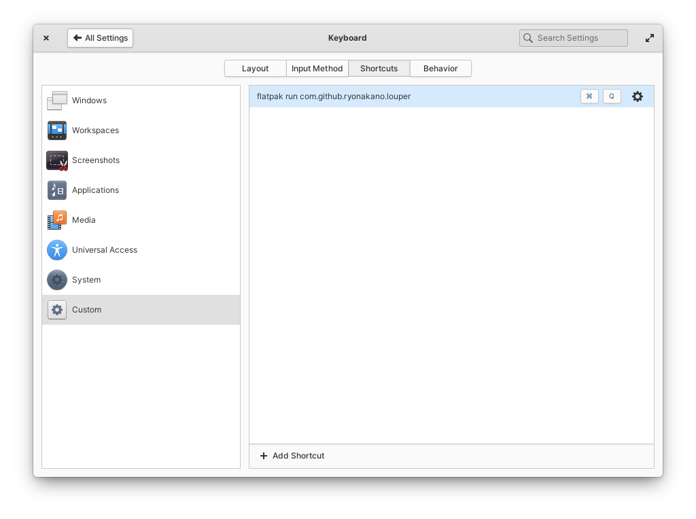

# Louper


Louper is a text magnification app that helps you zoom the selected text.

Select the text you want to magnify and just launch the app! The app shows the selected text in huge size.

Other features include:

* Select some part of the magnified text and press Ctrl+C or perform secondary click to copy it
* Press Esc or Ctrl+Q or unfocus the window to close the app

## Installation
### From AppCenter (Recommended)
Click the button to get Louper on AppCenter if you're on elementary OS:

[](https://appcenter.elementary.io/com.github.ryonakano.louper)

### From Community Packages
Community packages maintained by volunteers are also available on some distributions:

[](https://repology.org/project/louper/versions)

### From Source Code (Flatpak)
You'll need `flatpak` and `flatpak-builder` commands installed on your system.

Run `flatpak remote-add` to add AppCenter remote for dependencies:

```
flatpak remote-add --user --if-not-exists appcenter https://flatpak.elementary.io/repo.flatpakrepo
```

To build and install, use `flatpak-builder`, then execute with `flatpak run`:

```
flatpak-builder builddir --user --install --force-clean --install-deps-from=appcenter com.github.ryonakano.louper.yml
flatpak run com.github.ryonakano.louper
```

### From Source Code (Native)
You'll need the following dependencies to build:

* libglib2.0-dev (>= 2.74)
* libgranite-7-dev
* libgtk-4-dev (>= 4.12)
* meson (>= 0.57.0)
* valac

Run `meson setup` to configure the build environment and run `meson compile` to build:

```bash
meson setup builddir --prefix=/usr
meson compile -C builddir
```

To install, use `meson install`, then execute with `com.github.ryonakano.louper`:

```bash
meson install -C builddir
com.github.ryonakano.louper
```

## Usage
1. Select some text
2. Launch the app. The app shows the selected text in huge size
3. Select some part of the magnified text and press `Ctrl+C` or perform secondary click to copy it
4. Press `Esc`/`Ctrl+Q` or unfocus the window to close the app

It is recommended to assign a shortcut key to launch the app for daily use:

1. Go to **System Settings→Keyboard→Shortcuts→Custom**
2. Click the `+ Add Shortcut` button at the bottom of the right pane
3. Set `flatpak run com.github.ryonakano.louper` as a triggered command



You can also use the following command line options:

```
-k, --keep-open            Keep the app window open when unfocused
-t, --text=TEXT            The text to zoom in; the clipboard is used if none specified
```

## Contributing
Please refer to [the contribution guideline](CONTRIBUTING.md) if you would like to:

- submit bug reports / feature requests
- propose coding changes
- translate the project

## Get Support
Need help in use of the app? Refer to [the discussions page](https://github.com/ryonakano/louper/discussions) to search for existing discussions or [start a new discussion](https://github.com/ryonakano/louper/discussions/new/choose) if none is relevant.

## History
Originally designed for elementary OS as a prototype of the idea in https://github.com/elementary/wingpanel-indicator-a11y/issues/35
